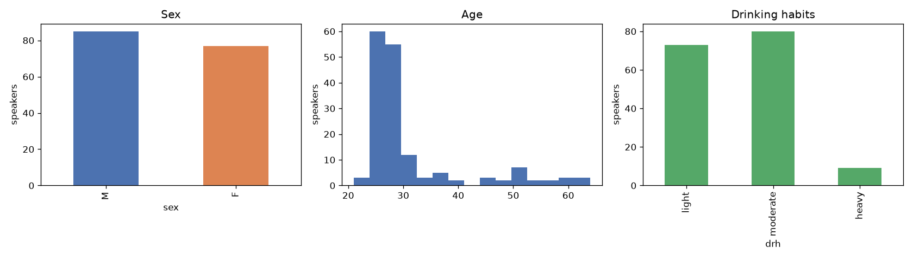
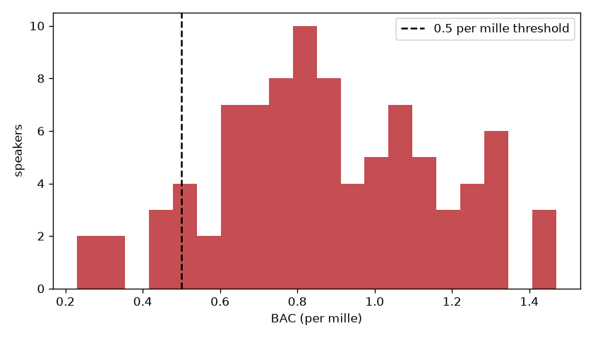

# Intoxicated speech detection

Can a model tell from a short recording whether the speaker is drunk? This project trains a CNN on
MFCC features from the **Alcohol Language Corpus (ALC)**, 162 German speakers recorded both sober
and at a blood alcohol concentration (BAC) of roughly 0.3–1.5 per mille.

Course project for ELEC-E5510 *Speech Recognition* at Aalto University (autumn 2024).



## How it works

1. **Features** (`alc/features.py`): audio resampled to 16 kHz, 13 MFCCs with deltas and
   delta-deltas (25 ms windows, 10 ms hop), per-coefficient mean/variance normalisation, padded or
   cut to 3 s.
2. **Speaker-independent split** (`alc/splits.py`): every speaker is in exactly one of train,
   validation or test, and the class balance is kept per split.
3. **Model** (`alc/model.py`): three conv blocks with batch norm, global average pooling, sigmoid
   output. Class weights balance the loss; early stopping watches validation AUC.
4. **Evaluation** (`alc/metrics.py`): **UAR** (unweighted average recall), the metric of the
   Interspeech 2011 Speaker State Challenge. About 2/3 of recordings are sober, so accuracy alone
   rewards a model that always says "sober".



## Usage

The corpus is licensed through the [Bavarian Archive for Speech Signals](https://www.bas.uni-muenchen.de/Bas/BasALCeng.html)
and is not included. Put it in `ALC/`, then:

```bash
pip install -r requirements.txt

python -m alc.speakers ALC annotation_analysis.csv   # one row per speaker
python -m alc.preprocess ALC data/features.npz        # MFCC features for every recording
python -m alc.train data/features.npz --out runs/cnn  # train + evaluate on unseen speakers
```

`runs/cnn/` then holds `metrics.json` (UAR, accuracy, per-class recall), the confusion matrix,
training curves, and `misclassified.csv` with the annotation of every wrong prediction (sex, age,
accent, drinking habits…) for error analysis.

`data_analysis.ipynb` explores the speakers from `annotation_analysis.csv` and runs without the
corpus.

## Tests

```bash
python -m pytest tests
```

The tests build a small synthetic corpus in the ALC folder layout and run the full pipeline,
including a 2-epoch training run, and check that no speaker is in both train and test.

## Project layout

```
alc/                          package: annotations, features, dataset, splits, model, train
tests/                        offline tests on synthetic audio
data_analysis.ipynb           speaker statistics
annotation_analysis.csv       one row per ALC speaker
experiments/2024-random-split first notebooks (speaker-dependent split, see its README)
```
